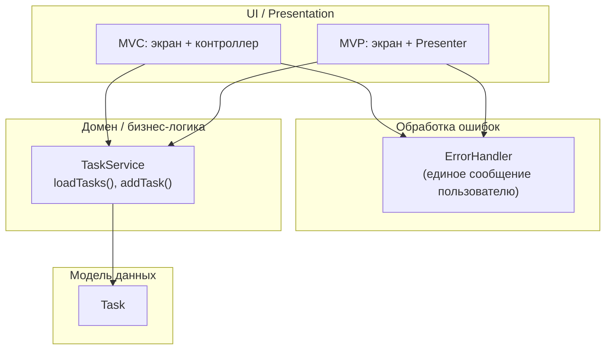

# Диаграмма слоёв (список задач)

Ответственности по слоям:

| Слой | Ответственность |
|------|-----------------|
| **View (экран)** | Вёрстка, ввод текста, кнопки, список, вызов `load` / `add` у контроллера или Presenter |
| **Controller (MVC)** | Состояние списка и `loading`, вызов `TaskService`, при ошибке — `ErrorHandler`, `notifyListeners` |
| **Presenter (MVP)** | Те же сценарии без виджетов; обновляет View через `TaskListMvpView` |
| **ErrorHandler** | Один формат сообщений: `TaskServiceException` → текст, иначе общая фраза; показ через callback |
| **TaskService** | Правила загрузки/добавления, задержки, тестовые сбои (`failNextLoad`, заголовок «ошибка») |
| **Task** | Неизменяемая сущность задачи |

Зависимости направлены **вниз**: UI → ErrorHandler + TaskService → Task. Presenter и Controller не зависят друг от друга.
